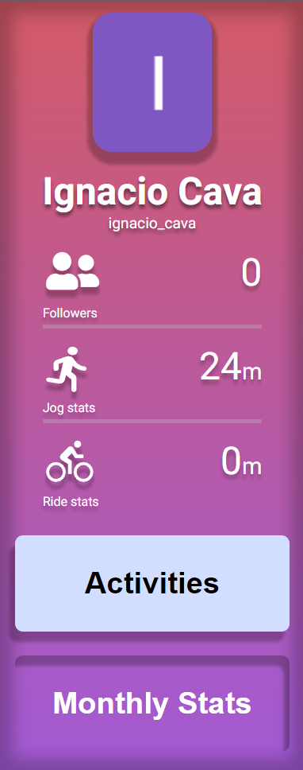
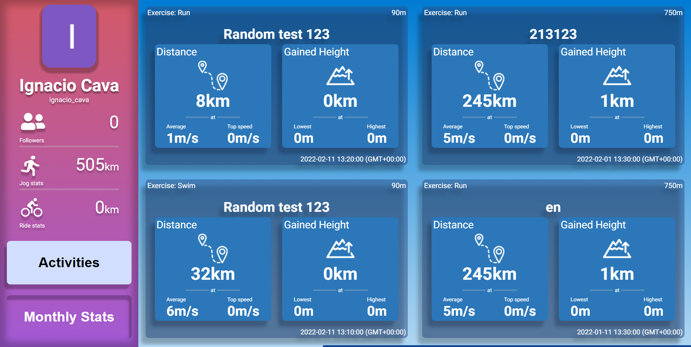
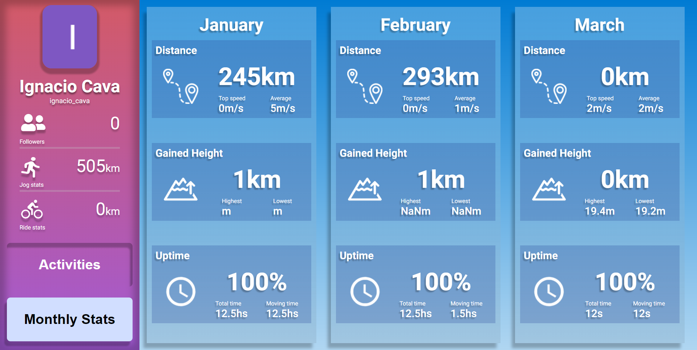
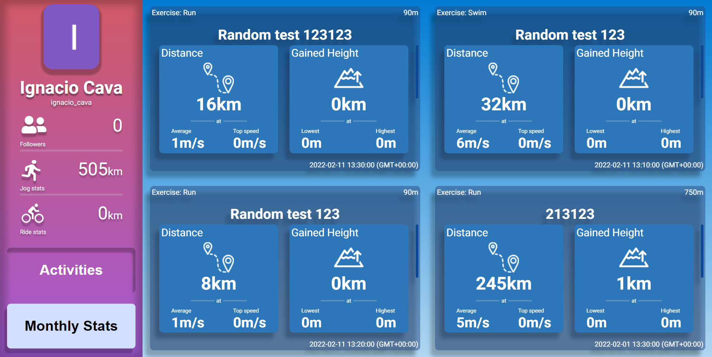

# Welcome to my presentation!

### Thank you so much for this opportunitty. In this section, you will learn how to use this app.

---

## Vert.run - React Assignment
Objective - Create a React application that implements the Redux pattern for managing application state. 

In this page, you have two sections:

Activities page
1. Retrieve a list of recent activities of a Strava user.
2. For each activity show name, date, distance, time and elevation gain.
Monthly Stats page
1. On this page, for each of the past 3 months, show how much has the
Strava user done in terms of distance, time and elevation gain
(aggregated data for the activities of the month).
2. When the user clicks on a month, the application should move to a
page that shows the activities of that month in the same format as the
“Activities page”.

---

## Sidebar

The sidebar is available in all pages, and it hosts:

- User icon.
- Name and nickname.
- Location (if the user has enabled it).
- Miscellaneous stats.
- Ability to scroll through various sections of the app.

## Activities section

Here, the user will be able to see all the activities they have ever done with information about various subjects, including:

- Exercise type.
- Duration and timezone where the exercise began
- Distance travelled.
- Height scalated during their trips.
- Uptime, as the relation between activity time and actual exercise time.
- Total, maximum and minimum stats for each section.

## Monthly stats

The monthly stats page hosts the user's combined stats over a given month. Right now, it only shows data regarding 3 months into the past. Here you can find:

- Month name.
- Accumulated stats.
- Maximum and minimum scores over the whole month.

## Monthly activities

Clicking on amonthly stats card will bring you to the monthly activities section. This page displays the user's total exercises for the clicked month.